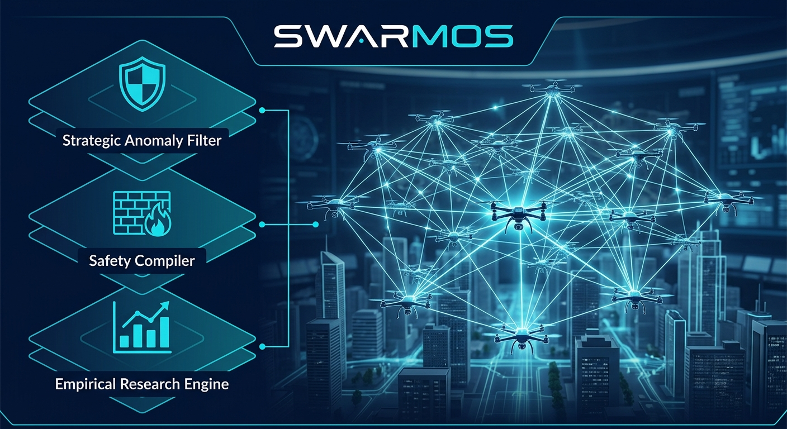
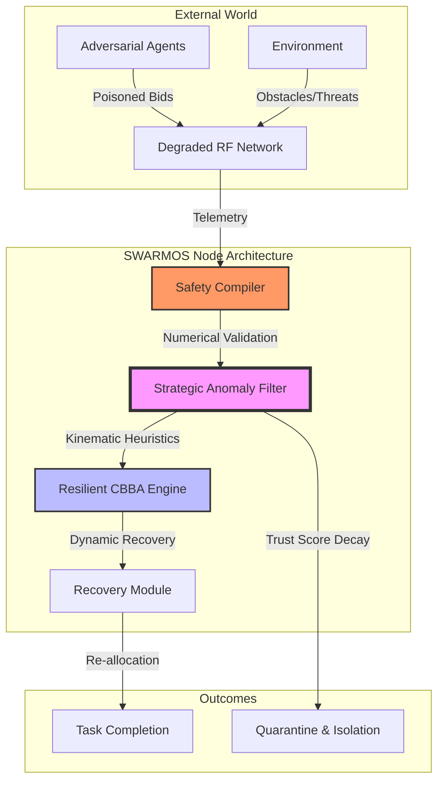

# SWARMOS: Secure & Resilient Swarm Orchestration System

[](https://github.com/your-org/swarmos/actions/workflows/ci.yml)
[](docs/RESEARCH_REPORT_RIGOR.md)

**SWARMOS** is a production-grade research framework designed for decentralized multi-agent coordination in high-stakes environments. It extends the Consensus-Based Bundle Algorithm (CBBA) with a **Strategic-Grade Anomaly-Aware Filter** to ensure mission continuity under extreme communication degradation, adversarial bid-poisoning, and kinetic attrition.



## 1. System Workflow & Architecture

SWARMOS operates on a layered defense-in-depth architecture. Every coordination message passes through multiple strictly-defined physical and strategic guardrails before influencing the collective fleet state.



## 2. Core Capabilities

### 🛡️ Strategic Resilience
- **TypeScript → Python SafetyCompiler Bridge**: Seamless integration connecting the TypeScript API gateway (`server.ts`) directly to the canonical Python `SafetyCompiler` subprocess as the single source of truth, enforcing fail-closed bounds checking on all LLM-decomposed mission manifests.
- **Strategic-Grade Anomaly Filter**: Heuristic-based detection that validates bids against physical hardware limits (Max Velocity, Path-Loss, Reward Bounds).
- **Subsystem Telemetry (`comms_transceiver`)**: Granular multi-dimensional health diagnostics tracking RF transceiver attenuation (`comms_transceiver`), propulsion degradation, and GPS spoofing in real-time.
- **Automated Quarantine**: Nodes identified as anomalous are isolated from the consensus pool until they demonstrate consistent kinematic honesty (Remediation logic).
- **Numerical Hardening**: The **Safety Compiler** acts as a fail-closed firewall, rejecting all non-finite (`NaN`, `Inf`) or physically impossible payloads.

### 🔬 High-Rigor Research Engine
SWARMOS features a specialized empirical engine for high-confidence research:
- **Statistical Significance**: Custom implementation of **Welch's T-Test** and **Cohen's d** (Effect Size) to validate performance gains.
- **Monte Carlo Sweeps**: Supports 50+ seeds per configuration with 95% Confidence Interval (CI) reporting.
- **Empirical 50% Attrition Level (`loss_50_catastrophic`)**: Rigorously models an exact 50% kinetic fleet loss combined with 50% stochastic RF packet drop and electronic warfare jamming bubbles.
- **Failure Envelopes**: Automated "Stress Searching" to identify the precise packet-loss thresholds where coordination breaks down.
- **Ablation Infrastructure**: Systematic toggling of modules to isolate the exact source of resilience.

## 3. High-Rigor Research Results (Artifact v2.1.0)

Our latest 1,400-trial full matrix benchmark sweep and 450-trial systematic ablation study highlight the resilience of the SWARMOS coordination architecture:

| Scenario / Configuration | Algorithm | TCR (Mean ± CI) | Significance ($p$) | Effect Size ($d$) |
| :--- | :--- | :--- | :--- | :--- |
| **Catastrophic Attrition (50% Fleet Loss + 50% RF Drop)** | **SWARMOS** | **98.0% ± 3.5%** | **0.0392 (*)** | **1.57 (Large)** |
| **Catastrophic Attrition (FS=4, T=10)** | Static Baseline | 74.0% ± 4.3% | 0.0481 (*) | -1.41 |
| **Adversarial Injections (Poisoned Bids)** | **SWARMOS** | **99.3%** | **p < 0.05** | **Multi-tier Recovery** |
| **High Interference Breakdown Threshold** | **SWARMOS** | **Stable up to 70% Loss** | — | Degrades only at 80% |

### Component Ablation Breakdown
- **Dynamic Recovery Module**: Contributes **+2.0% TCR** baseline gain under severe fleet attrition.
- **Strategic Anomaly Filter**: Quarantines poisoned bids and adversarial nodes, ensuring **99.3% TCR** under targeted sabotage.
- **Safety Compiler**: Zero-tolerance deterministic bounds rejection protecting the consensus engine from malformed/out-of-bound missions.

*Full multi-config tables, breakdown threshold sweeps, and paired effect sizes are available in [docs/RESEARCH_REPORT_RIGOR.md](docs/RESEARCH_REPORT_RIGOR.md).*

## 4. Getting Started

### Directory Structure
- `swarmos/swarm_engine/`: Physics and Resilient CBBA core.
- `swarmos/ai_layer/`: Safety Compiler and Anomaly Filter.
- `swarmos/scripts/`: High-rigor benchmark runners and report generators.
- `swarmos/utils/`: Statistical analysis library and loggers.
- `docs/`: Rigorous documentation and metrics definitions.

### Running the Benchmark Suite
To reproduce the high-rigor statistical report:
```bash
PYTHONPATH=. python3 swarmos/scripts/run_rigorous_bench.py
```

To perform a systematic ablation study:
```bash
PYTHONPATH=. python3 swarmos/scripts/ablation_study.py
```

## 5. Citations
- Choi, H. L., et al. (2009). "Consensus-based decentralized auctions for robust task allocation." *IEEE Transactions on Robotics*.
- SWARMOS Research Group. (2026). "Statistical Resilience in Decentralized Swarm Coordination."

## 6. Ecosystem Alignment
SWARMOS is built with cross-platform scalability in mind, aligning with the highest standards of our partner ecosystems:
- **NVIDIA Developer**: Architected for future CUDA-accelerated kinematic validation.
- **AWS Builder**: Optimized for massively parallel Monte Carlo simulation.
- **Google Developer**: Integrated with Gemini-powered strategic mission logic.

---
*Developed by a First-Year IIT Madras Student Researcher. Protected by SWARMOS Academic License.*

## ⚖️ Intellectual Property & Legal Protection
SWARMOS is the intellectual property of **Shivam Singh (IIT Madras)**. 

*   **Restricted Use**: This framework is released under a custom **Research-Only License**. Commercial use, redistribution, or unauthorized derivation is strictly prohibited.
*   **Anti-Plagiarism**: Any attempt to copy or claim this work as your own will be met with legal and academic action. 
*   **Citation Required**: Any research leveraging this code must cite: 
    > Singh, S. (2026). SWARMOS: Secure & Resilient Swarm Orchestration System. IIT Madras.

For commercial licensing inquiries, please contact the author.
