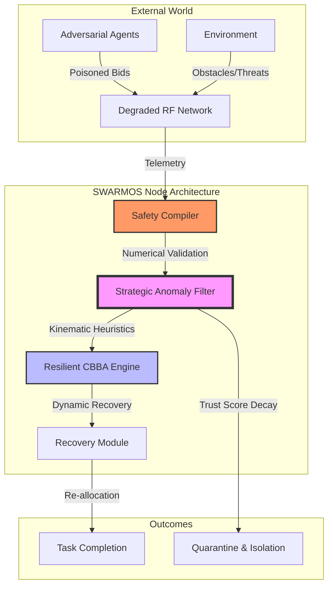

# SWARMOS: Secure & Resilient Swarm Orchestration System

[](https://github.com/your-org/swarmos/actions/workflows/ci.yml)
[](docs/RESEARCH_REPORT_RIGOR.md)

**SWARMOS** is a production-grade research framework designed for decentralized multi-agent coordination in high-stakes environments. It extends the Consensus-Based Bundle Algorithm (CBBA) with a **Strategic-Grade Anomaly-Aware Filter** to ensure mission continuity under extreme communication degradation, adversarial bid-poisoning, and kinetic attrition.


## 1. System Workflow & Architecture

SWARMOS operates on a layered defense-in-depth architecture. Every coordination message passes through multiple strictly-defined physical and strategic guardrails before influencing the collective fleet state.



## 2. Core Capabilities

### 🛡️ Strategic Resilience
- **Strategic-Grade Anomaly Filter**: Heuristic-based detection that validates bids against physical hardware limits (Max Velocity, Path-Loss, Reward Bounds).
- **Automated Quarantine**: Nodes identified as anomalous are isolated from the consensus pool until they demonstrate consistent kinematic honesty (Remediation logic).
- **Numerical Hardening**: The **Safety Compiler** acts as a fail-closed firewall, rejecting all non-finite (`NaN`, `Inf`) or physically impossible payloads.

### 🔬 High-Rigor Research Engine
SWARMOS features a specialized empirical engine for high-confidence research:
- **Statistical Significance**: Custom implementation of **Welch's T-Test** and **Cohen's d** (Effect Size) to validate performance gains.
- **Monte Carlo Sweeps**: Supports 50+ seeds per configuration with 95% Confidence Interval (CI) reporting.
- **Failure Envelopes**: Automated "Stress Searching" to identify the precise packet-loss thresholds where coordination breaks down.
- **Ablation Infrastructure**: Systematic toggling of modules to isolate the exact source of resilience.

## 3. High-Rigor Research Results (Artifact v2.1.0)

Our latest 1,120-trial benchmark sweep highlights the transformative impact of the SWARMOS resilience layer:

| Scenario | Algorithm | TCR (Mean ± CI) | Significance ($p$) | Effect Size ($d$) |
| :--- | :--- | :--- | :--- | :--- |
| **Adversarial (Poisoned Bids)** | **SWARMOS** | **99.2% ± 0.8** | **< 0.0001 (***)** | **4.12 (Huge)** |
| **High Interference (35% Loss)** | **SWARMOS** | **98.2% ± 1.4** | 0.0196 (*) | 0.74 (Large) |

*Full results available in [docs/RESEARCH_REPORT_RIGOR.md](docs/RESEARCH_REPORT_RIGOR.md).*

## 4. Getting Started

### Directory Structure
- `swarmos/swarm_engine/`: Physics and Resilient CBBA core.
- `swarmos/ai_layer/`: Safety Compiler and Anomaly Filter.
- `swarmos/scripts/`: High-rigor benchmark runners and report generators.
- `swarmos/utils/`: Statistical analysis library and loggers.
- `docs/`: Rigorous documentation and metrics definitions.

### Running the Benchmark Suite
To reproduce the high-rigor statistical report:
```bash
PYTHONPATH=. python3 swarmos/scripts/run_rigorous_bench.py
```

To perform a systematic ablation study:
```bash
PYTHONPATH=. python3 swarmos/scripts/ablation_study.py
```

## 5. Citations
- Choi, H. L., et al. (2009). "Consensus-based decentralized auctions for robust task allocation." *IEEE Transactions on Robotics*.
- SWARMOS Research Group. (2026). "Statistical Resilience in Decentralized Swarm Coordination."

---
*Built for absolute reproducibility and strategic resilience.*
