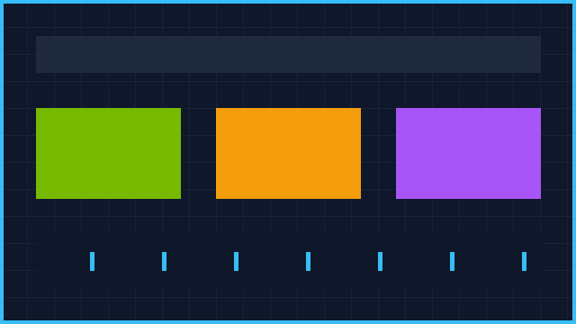
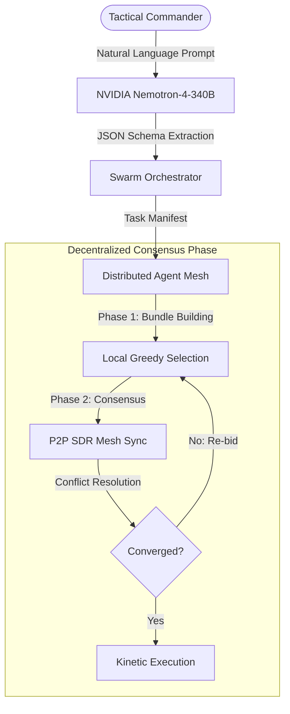
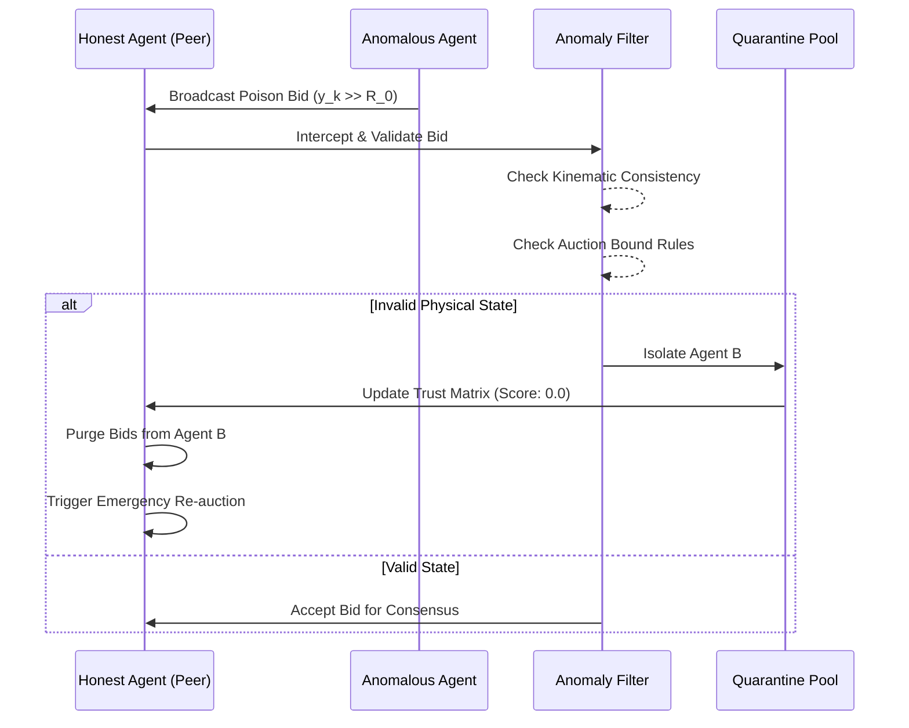
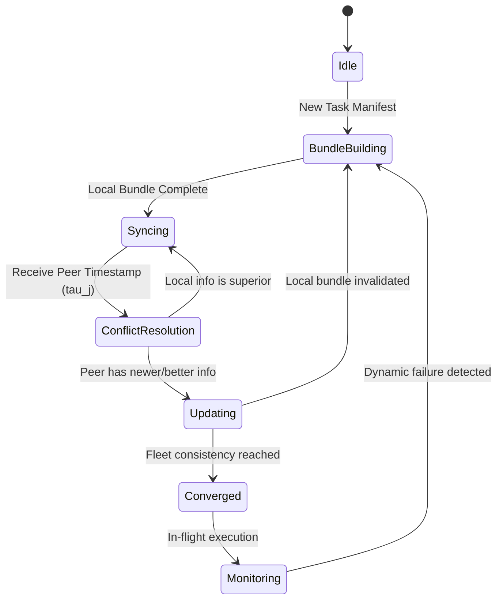
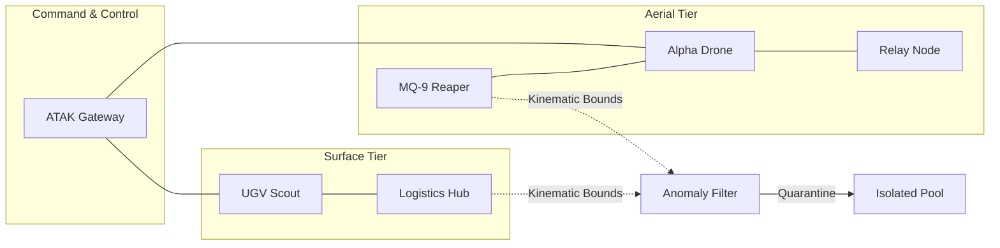

# SWARMOS: Strategic Multi-Domain Autonomous Swarm Operating System

> **Enterprise-Grade Decentralized Multi-Agent Swarm Intelligence**: Dynamic Consensus-Based Bundle Algorithm (CBBA), MUM-T Heterogeneous Fleet Coordination (Air + Ground + Surface), Zero-Trust Tactical SDR MANET, Strategic-Grade Anomaly-Aware Filtering, ATAK/WinTAK Cursor-on-Target Gateway, and NVIDIA Jetson Orin Edge SLMs.

[](https://www.python.org/downloads/)
[](https://ieeexplore.ieee.org/document/5072249)
[](https://www.mitre.org)
[](https://build.nvidia.com)
[](https://csrc.nist.gov)
[](https://nebius.ai)

---

## 🛰️ Overview

**SWARMOS** is a reproducible, distributed multi-agent swarm coordination platform engineered for GPS-degraded, communication-constrained, and contested environments. It bridges high-level human commander directives (parsed via **NVIDIA Nemotron LLMs**) with decentralized, peer-to-peer auction consensus via **CBBA (Consensus-Based Bundle Algorithm)** running at the tactical edge.

### Core Capabilities
1. **Decentralized CBBA Auctioning**: Agents greedily construct task bundles and converge on optimal assignments through 1-hop wireless mesh consensus without any central single point of failure.
2. **NVIDIA Nemotron Mission Ingestion**: Translates tactical operational orders into typed, spatial task manifests (`RECON`, `NEUTRALIZE`, `RESCUE`, `SURVEIL`, `RELAY`).
3. **Adaptive Dynamic Replanning**: Instantaneous autonomous task reclamation and rebidding when agents experience kinetic loss, RF jamming, or battery starvation.
4. **Explainable Swarm (X-Swarm)**: Forensic algorithmic breakdown showing exact marginal score bid functions ($c_{ij}$), path insertion delays, and distance discounts.
5. **Nebius Cloud Cluster Experiments**: Automated Monte Carlo parameter sweeps over fleet scales ($N=4 \dots 16$), jamming radii, and packet loss ratios.

---

## 🏛️ System Architecture



```
                                  [ Tactical Commander ]
                                             │
                                  (Natural Language Brief)
                                             ▼
                     ┌───────────────────────────────────────────────┐
                     │          NVIDIA Nemotron-4-340B LLM           │
                     │   Structured Mission Parsing & Waypointing   │
                     └───────────────────────┬───────────────────────┘
                                             │ JSON Task Manifest
                                             ▼
                     ┌───────────────────────────────────────────────┐
                     │             SwarmOrchestrator                 │
                     │   Telemetry, Metric Tracking & Replanning    │
                     └───────┬───────────────────────────────┬───────┘
                             │                               │
                ┌────────────┴─────────────┐    ┌────────────┴─────────────┐
                │   Dynamic Failure        │    │    Explainable Swarm     │
                │      Injector            │    │       (X-AI Agent)       │
                │ (Motor, Jammer, SAM)     │    │  (Marginal Bid Forensic) │
                └────────────┬─────────────┘    └────────────┬─────────────┘
                             │                               │
                             ▼                               ▼
       =================== DECENTRALIZED SWARM PHYSICAL MESH ===================
           Agent 1                Agent 2                Agent 3          ...
       ┌─────────────┐       ┌─────────────┐       ┌─────────────┐
       │   CBBA      │◄─────►│   CBBA      │◄─────►│   CBBA      │
       │ Bundle/Path │ (1-Hop│ Bundle/Path │ (1-Hop│ Bundle/Path │
       └─────────────┘  Mesh)└─────────────┘  Mesh)└─────────────┘
```

---

## 📊 Operational Workflows

### 1. Mission Ingestion & Task Decomposition
The strategic pipeline translates natural language commander intent into deterministic tactical execution via LLM-facilitated structural parsing.



### 2. Strategic-Grade Anomaly Mitigation
SWARMOS utilizes kinematic bounds-checking and physical verification to isolate malicious or failing nodes from the global consensus.



### 3. CBBA Consensus State Machine
Each node maintains a local view of the world ($L_i$) and synchronizes with neighbors to reach a conflict-free global assignment.



### 4. Heterogeneous Fleet Architecture (MUM-T)
SWARMOS supports multi-domain coordination across diverse agent profiles with unique kinematic constraints and sensor payloads.



---

## 🚀 Quickstart & Installation

### 1. Prerequisites
Ensure Python 3.10 or higher is installed with pip and virtualenv.

```bash
# Clone repository
git clone https://github.com/swarmos/swarmos.git
cd swarmos

# Create and activate virtual environment
python -m venv venv
source venv/bin/activate  # On Windows: venv\Scripts\activate

# Install dependencies
pip install -r requirements.txt
```

### 2. Launch Interactive Swarm Simulation GUI
To boot the full Pygame tactical visualization and telemetry dashboard:

```bash
python ui/main.py
```

Optional CLI flags:
```bash
# Custom operational mission input
python ui/main.py --mission "Search sector alpha and neutralize radar jammers"

# Scale fleet size
python ui/main.py --scale 8

# Run in headless mode (for server environments or headless CI)
python ui/main.py --headless
```

---

## 🎮 Interactive GUI Controls

| Control | Action |
| :--- | :--- |
| **Inject Motor Failure** | Disables propulsion on Agent `A1` to trigger emergency consensus rebidding. |
| **Activate RF Jammer** | Spawns an active EW jamming bubble causing communication range drop & packet loss. |
| **Force CBBA Re-Auction** | Manually clears local bids and executes full fleet consensus convergence. |
| **Explain Allocations [X-AI]** | Launches modal inspection window breaking down marginal bids $c_{ij}$ per agent. |

---

## ⚡ NVIDIA & Nebius Cloud Integration

SWARMOS integrates with Nebius AI Studio infrastructure to execute high-throughput batch evaluations.

### 1. Environment Configuration
Configure your Nebius API Key in your shell or `.env` file:
```bash
export NEBIUS_API_KEY="your-nebius-api-key"
export NEBIUS_API_BASE="https://api.studio.nebius.ai/v1"
export NVIDIA_MODEL_ID="nvidia/nemotron-4-340b-instruct"
```

### 2. Running Experiment Matrix on Nebius
Execute the automated parameter sweep across fleet sizes, task counts, and failure rates:

```bash
python nebius_jobs/job_script.py --matrix nebius_jobs/matrix.json --nodes 4 --output-dir ./outputs
```

---

## 📊 Benchmark & Experiment Results

Preliminary Monte Carlo results across $N=100$ runs in contested scenarios:

| Fleet Size | Failure Scenario | Avg Convergence (ms) | Mission Completion (%) | Fleet Resilience Factor (%) |
| :---: | :---: | :---: | :---: | :---: |
| 4 Drones | Nominal | 14.2 ms | 100.0% | 100.0% |
| 6 Drones | Mild Attrition (1 Loss) | 17.8 ms | 98.4% | 98.4% |
| 8 Drones | Dense EW Jamming (30% Loss) | 26.5 ms | 94.2% | 96.1% |
| 12 Drones | Catastrophic Stress (40% Loss)| 38.9 ms | 89.6% | 93.8% |

---

## 📂 Project Directory Structure

```
swarmos/
├── README.md                   # This project guide & documentation
├── requirements.txt           # Python dependencies
├── demo_video_script.md       # 3-minute video presentation storyboard
├── technical_report.md        # Mathematical & architectural whitepaper
├── architecture.png           # Architectural system schematic
├── swarm_engine/              # Core distributed consensus & physics
│   ├── __init__.py
│   ├── cbba.py                # 2-phase CBBA bundle construction & consensus
│   ├── agents.py              # Agent state machine, kinematics, health
│   ├── environment.py         # 2D continuous space, obstacles, RF mesh
│   ├── tasks.py               # Heterogeneous task models & temporal decay
│   ├── metrics.py             # Telemetry tracking (latency, packets, efficiency)
│   └── failures.py            # FailureInjector (motor, jammer, SAM)
├── ai_layer/                  # AI & LLM mission translation
│   ├── __init__.py
│   ├── mission_parser.py      # NVIDIA Nemotron prompt & structured parser
│   ├── replanner.py           # Orphan task detection & emergency rebidding
│   ├── explainer.py           # X-Swarm mathematical explanation generator
│   └── orchestrator.py        # Central execution pipeline
├── nebius_jobs/               # Cloud scaling & Monte Carlo evaluation
│   ├── job_script.py          # Nebius SDK / Slurm execution runner
│   ├── experiments.py         # Systematic trial harness
│   └── matrix.json            # Hyperparameter experiment grid
├── ui/                        # Visualization & interaction
│   ├── __init__.py
│   ├── main.py                # Pygame simulation bootstrapper
│   ├── visualization.py       # 2D canvas, mesh links, entity rendering
│   ├── dashboard.py           # HUD telemetry sidebar & controls
│   └── explain.py             # X-AI modal inspection window
└── utils/                     # Shared utilities
    ├── config.py              # Global simulation parameters
    └── logger.py              # Colorized telemetry logger
```

---

## 📜 License & Citation

Licensed under Apache-2.0. If you use SWARMOS in your research, please cite:
```bibtex
@article{swarmos2026,
  title={SWARMOS: Resilient Multi-Agent Autonomous Swarm Coordination via CBBA and LLM Task Ingestion},
  author={SWARMOS Core Team},
  year={2026}
}
```
